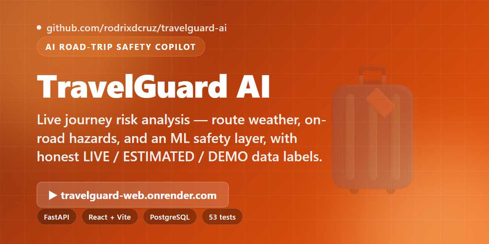
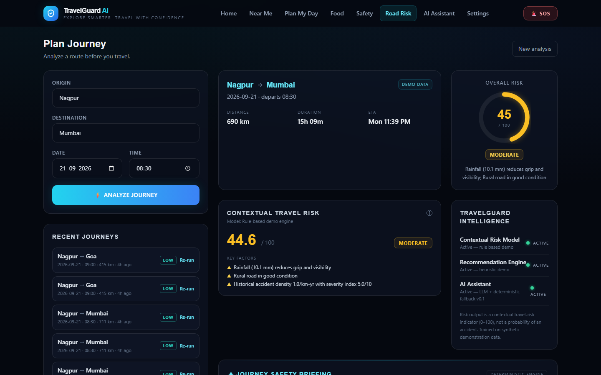
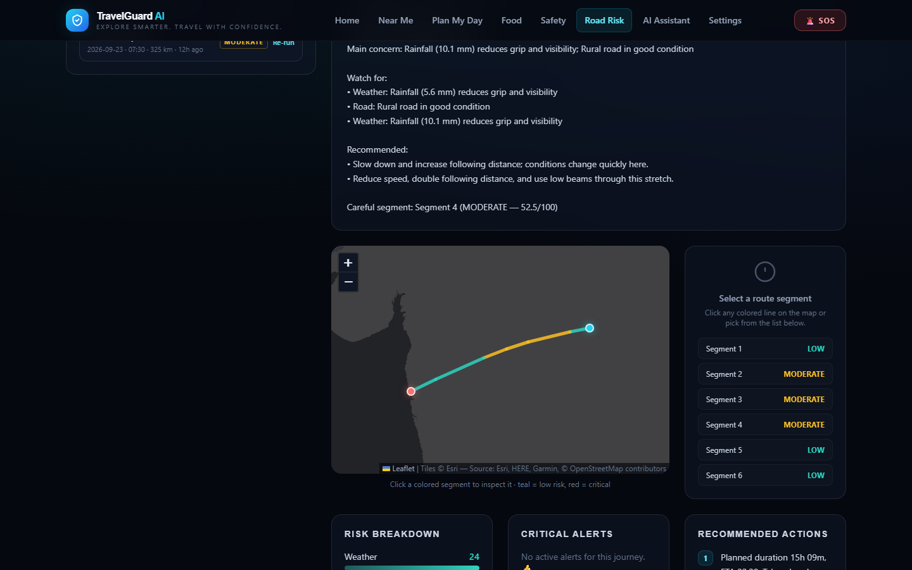
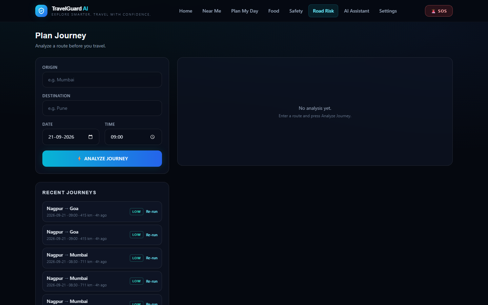
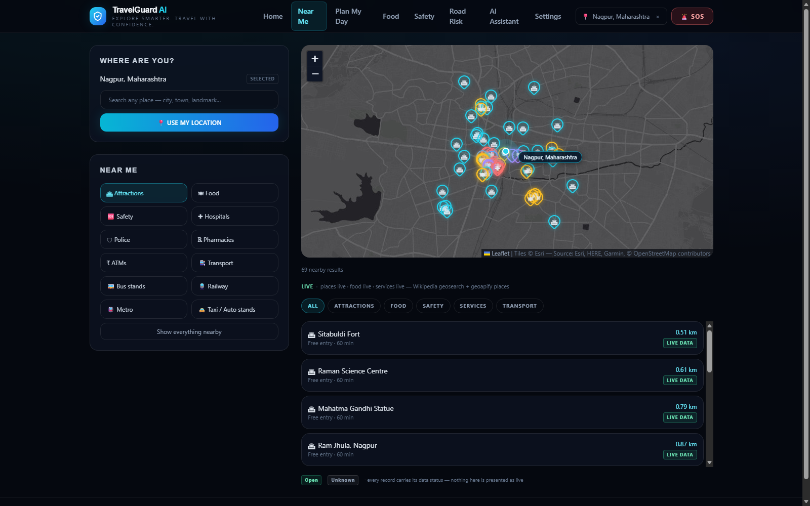
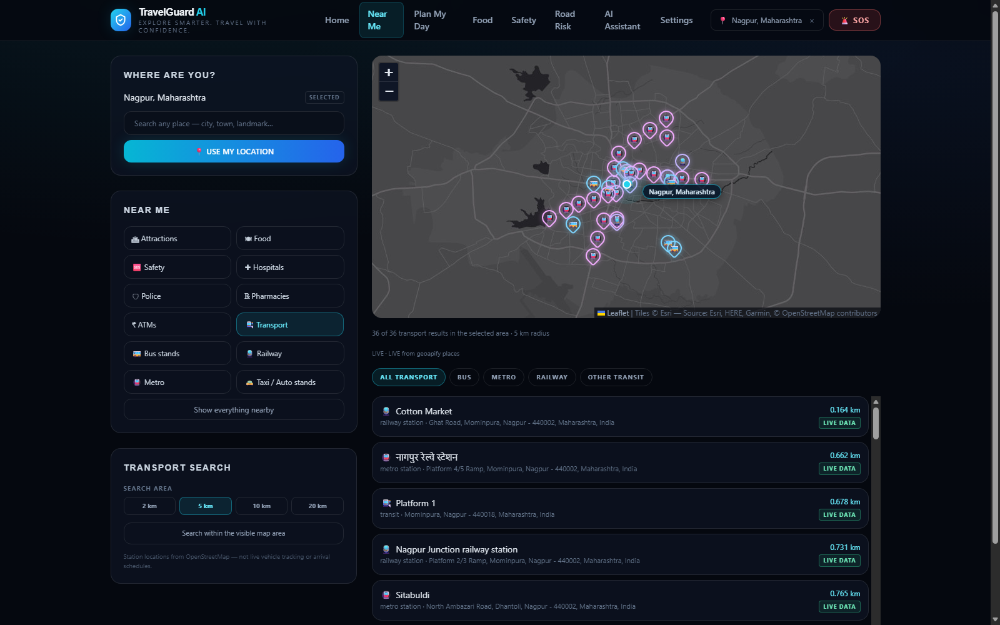
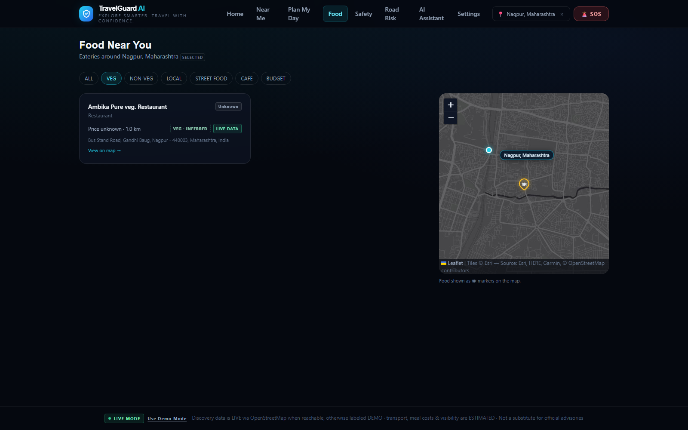
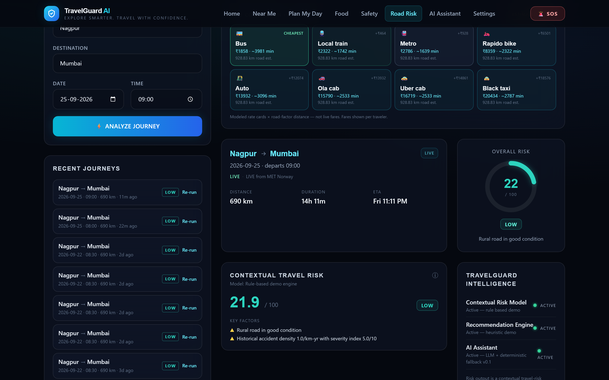

<div align="center">

</div>

# TravelGuard AI

**Know the Risk Before You Reach It.**

[](https://github.com/rodrixdcruz/travelguard-ai/actions/workflows/ci.yml)


*Live mode end-to-end: honest location prompt → Nagpur via real place search →
Near Me discovery with transit POIs on the map → journey analysis with the
8-mode fare comparison.*

> 🌐 **Live:** [travelguard-web.onrender.com](https://travelguard-web.onrender.com) ·
> API: [travelguard-api.onrender.com/health](https://travelguard-api.onrender.com/health)
> — no login needed; defaults to **LIVE MODE** (real GPS location, key-less live
> providers for geocoding/places/weather) with every item labeled LIVE, ESTIMATED
> or DEMO. The free backend wakes in ~30–50s if it has been idle.

An AI-powered road-risk intelligence platform. Enter a journey — origin, destination,
date and time — and TravelGuard analyzes the route before you travel: weather, road
conditions, accident history and disruptions, segment by segment, with an explainable
risk score and a safety briefing.

> **Status: MVP + ML layer.** The ML intelligence layer (contextual risk model +
> recommendation engine) trains and runs on **synthetic demonstration data** and
> falls back transparently to the rule engine when artifacts are absent. Live
> providers are all key-less: weather uses **MET Norway Locationforecast**
> (primary — chosen because it does not throttle shared cloud egress IPs) with
> **Open-Meteo** as fallback, and geocoding/places use **OpenStreetMap**
> (Nominatim + Overpass). When a provider is unreachable the app says so
> instead of faking it. Demo Mode remains available as an explicit, labeled toggle.
>
> **Persistence:** when `DATABASE_URL` is set (the live deployment uses Neon
> PostgreSQL), every analyzed journey is stored and served by
> `GET /api/journeys/recent` — writes are best-effort and never fail an analysis.
> Without a database the API behaves exactly as pure demo mode.

## Screenshots

**Journey planner** — any route, analyzed before you travel: distance, duration,
ETA, an explainable risk score and the key factors behind it (Nagpur → Mumbai
shown, with the Recent Journeys panel beside the form).



**Interactive risk map** — the route split into color-coded segments; click any
segment to inspect its weather, road condition and safety guidance.



**Recent journeys** — every analysis is persisted (Neon PostgreSQL on the live
deployment) and can be re-run against current conditions in one click.



**Live discovery (Near Me)** — famous local places, food, safety services and
transport, all key-less via OpenStreetMap. Categories include attractions with
lakes, gardens, parks and zoos; bus stands, railway and metro stations, and
taxi/auto stands — every result labeled LIVE or DEMO by the provider summary
line. The pulsing cyan dot marks your position with a hoverable "You are here"
label naming the spot.



**Transport discovery** — the dedicated Transport view lists every transit
stop/station in the selected area (bus, metro, railway, tram, platforms),
fetched per category so no mode crowds out another, with a radius selector or
visible-map-area search.



**Food filters that stay honest** — when OSM maps no diet tags, the VEG filter
still works on conservative name-based inference ("Pure Veg", "Jain", "Sattvik"),
badged as dashed **VEG · INFERRED** with a tooltip — never merged into the
confirmed data flags. Unprovable filters say so instead of implying the area
has no such food.



**Fare comparison** — every journey result compares all 8 transport modes
(bus, local train, metro, Rapido, auto, Ola, Uber, taxi) cheapest-first, with
the cheapest highlighted and honest "modeled rate cards, not live fares"
labeling.



## ML intelligence layer

Hybrid architecture — each layer does only its own job:

```
Data → Feature Engineering → ML prediction → Risk engine (cross-check/fallback)
     → Itinerary optimizer → LLM explanation → Frontend
```

| Component | Model | Output |
|---|---|---|
| Contextual risk | `RandomForestRegressor` (safety_rf_v0_1) | Contextual Travel Risk Score 0–100 (not an accident probability) |
| Place ranking | `GradientBoostingRegressor` (recommender_gb_v0_1) | preference score + reasons from actual features |
| Itinerary | deterministic greedy feasibility optimizer | stops under time/budget/opening-hours/safety constraints |
| Explanation | LLM (optional) or deterministic fallback | natural-language briefing only — never numbers |

- 13 engineered features (`backend/app/ml/features.py`), training data generated
deterministically (seed 42) into `data/ml/training_data.csv` — **synthetic, documented
in `data/ml/README.md`**.
- Journey analysis blends ML (60%) with the deterministic risk engine (40%); the
response reports `intelligence_mode: random_forest | rule_based_demo` and the UI
shows exactly which system produced a score. Missing artifacts → full rule-engine
fallback, honestly labeled.

### Train / evaluate / test

```bash
cd backend
python -m app.ml.train        # generates data if missing, trains both models, prints real MAE/R²
python -m app.ml.evaluate     # recompute metrics on a held-out split
python -m pytest tests/ -q    # full suite: features, ordering, fallback, ranking, optimizer, API
```

Artifacts land in `models/` (git-ignored; reproducible). ML endpoints:
`POST /api/ml/safety-predict`, `POST /api/ml/recommend`, `POST /api/ml/itinerary`,
`GET /api/ml/info`. The Settings page hosts the live ML-pipeline demo and the
recommendation playground for judges.

---

## Tests & honesty guarantees

CI runs on every push/PR (badge at the top): **backend pytest on Python 3.12**
and the exact **frontend production build** (`tsc -b && vite build`) that Render
deploys. The backend suite is fully hermetic — `TRAVELGUARD_DISABLE_LIVE_PROVIDERS=1`
makes every live provider honor the kill-switch, so tests make **zero external
HTTP calls** (no flaky network, no provider quota burn) while still exercising
the fallback paths. The suite currently reports 144 passing tests in CI.

What the tests lock down — the guarantees a demo reviewer can rely on:

| Guarantee | How it's tested |
|---|---|
| **Every record carries its data status** | Providers emit `LIVE` / `DEMO` / `ESTIMATED` / `UNAVAILABLE` and the API reports the *actual* status of what was served (`test_provider_summary`, `test_discovery`) |
| **Honest fallback chains** | Geoapify → key-less OSM → labeled DEMO: a provider that legitimately finds nothing returns an honest empty — never masked with demo data (`test_geoapify_places`, `test_discovery`) |
| **Nothing is fabricated** | Missing phone numbers, prices and diet tags stay `None`/omitted — the UI says "unavailable in current data" instead of guessing (`test_geoapify_places`, `test_discovery`) |
| **Inference is labeled, never merged** | Name-based veg hints live in a separate `veg_hint` field: tags win over hints, hints never satisfy the strict `vegetarian` filter, demo rows never get hints (`test_veg_hints`) |
| **No kind crowds out another** | Services and transport discovery fan out per category with pagination + dedup, so a dense hospital/bus cluster can't hide pharmacies, ATMs or metro stops (`test_geoapify_places`) |
| **ML is honest about itself** | Missing model artifacts → transparent `rule_based_demo` fallback; scoring blends and intelligence modes are reported, and training data is synthetic & documented (`test_ml`) |

```bash
cd backend
python -m pytest tests/ -q   # hermetic: no network, no keys needed
```

---

## What it does

| Area | Details |
|---|---|
| **Journey analysis** | `POST /api/analyze-journey` — route, distance, duration, ETA |
| **Segment-level risk** | Route split into 6 segments, each scored 0–100 (LOW / MODERATE / HIGH / CRITICAL) |
| **Risk engine** | Deterministic weighted scoring: weather (30%), road (24%), accident (22%), disruption (14%), time (10%) |
| **Risk map** | Dark Leaflet map, route colored by segment risk, click a segment for full details |
| **Safety briefing** | AI-generated summary (LLM if `AI_API_KEY` is set, deterministic fallback otherwise — never fabricates) |
| **AI assistant** | `POST /api/ai/chat` — ask "Why is this route risky?", "What is the biggest risk?", "What should I do?" |
| **Alerts & actions** | Critical alerts per segment + prioritized recommendations, all derived from the computed data |
| **Live discovery** | Key-less OSM discovery of famous places (incl. lakes, gardens, parks, zoos), food, hospitals, police, pharmacies, ATMs, bus stands, railway/metro stations and taxi/auto stands — provider-labeled LIVE/DEMO with a consistent summary line |
| **Transport modes & fares** | 8 modeled modes (bus, local train, metro, Rapido, auto, Ola, Uber, taxi) with per-journey cheapest-first fare comparison — honestly ESTIMATED, never live fares |
| **Multi-day planning** | Plan My Day builds 1–7-day itineraries: unique places per day, meal windows, trip-level time/cost vs a client-set budget |

## Tech stack

- **Frontend:** React 18 + Vite + TypeScript + Tailwind CSS, React Leaflet (dark tiles)
- **Backend:** Python FastAPI + Pydantic v2, SQLAlchemy 2.0 (optional PostgreSQL)
- **AI:** OpenAI-compatible chat API (optional) with deterministic fallback
- **Infra:** Docker Compose (frontend, backend, postgres)

## Repository structure

```
travelguard-ai/
├── frontend/            # React + Vite + TS + Tailwind
│   └── src/
│       ├── components/  # JourneyForm, ResultsView, RiskMap, briefing UI
│       ├── pages/       # Dashboard, Plan Journey, Alerts, History, Assistant, Settings
│       ├── map/         # RiskMap (Leaflet, risk-colored segments)
│       ├── services/    # Central API client (single base-URL source)
│       ├── context/     # Journey state (React context)
│       └── types/       # TS types mirroring backend schemas
├── backend/
│   └── app/
│       ├── main.py      # FastAPI endpoints
│       ├── schemas.py   # Pydantic models
│       ├── risk_engine.py   # Deterministic scoring (pure functions)
│       ├── services.py  # Routing/weather/road/disruption providers (demo fallbacks)
│       ├── demo_data.py # Deterministic demo dataset
│       ├── ai.py        # LLM + deterministic briefing/chat
│       ├── config.py    # Env-based settings
│       └── database.py  # SQLAlchemy foundation (optional)
├── docker-compose.yml   # frontend + backend + postgres
└── .env.example         # All configuration, no secrets
```

## Local setup

### Backend (FastAPI)

```bash
cd backend
python -m venv .venv && source .venv/bin/activate   # Windows: .venv\Scripts\activate
pip install -r requirements.txt
uvicorn app.main:app --reload --port 8000
```

Verify: `curl http://localhost:8000/health` → `{"status": "ok", "service": "TravelGuard AI", ...}`

### Frontend (Vite)

```bash
cd frontend
npm install
npm run dev        # http://localhost:5173
```

The frontend talks to `http://localhost:8000` by default. Override with
`VITE_API_BASE_URL` in `frontend/.env.local` if needed.

### Docker (all-in-one)

```bash
cp .env.example .env
docker compose up --build
```

- Frontend: http://localhost:5173
- Backend: http://localhost:8000/health
- Postgres: localhost:5432 (travelguard/travelguard)

## Environment variables

Copy `.env.example` → `.env` (backend) and/or `frontend/.env.local`. Everything is
optional — with no keys the app still runs in **LIVE MODE** on key-less providers
(MET Norway weather → Open-Meteo fallback, OpenStreetMap geocoding/places).

| Variable | Purpose |
|---|---|
| `APP_NAME`, `ENVIRONMENT`, `LOG_LEVEL` | Basic app config |
| `DATABASE_URL` | PostgreSQL URL (SQLAlchemy). Unset = no DB writes |
| `WEATHER_API_KEY` | Optional extra weather provider (overrides the key-less MET Norway → Open-Meteo chain if wired) |
| `ROUTING_API_URL` | Live routing provider |
| `ACCIDENT_API_KEY` | Accident-history provider |
| `AI_API_KEY`, `AI_MODEL`, `AI_BASE_URL` | OpenAI-compatible LLM for briefings/chat |
| `FRONTEND_URL` | CORS origin for the backend |
| `GEOAPIFY_API_KEY` | Optional key for geocoding (place search + GPS naming) AND live discovery (food, ATMs, transit stops, leisure POIs). Key-less OSM stays as fallback — see note below |
| `VITE_API_BASE_URL` | Backend URL for the frontend |

Never commit real secrets — `.env` is git-ignored (`.env.example` is not).

## Demo routes

Deterministic sample data includes realistic profiles for **Mumbai ↔ Pune**,
**Delhi ↔ Jaipur**, **Bengaluru ↔ Mysuru**, **Bengaluru ↔ Chennai** (including ghat
sections, monsoon disruptions, accident blackspots). Any other city pair gets a
stable generated route, so every input works.

## Deployment (Render + Vercel)

The MVP deploys as-is; only environment variables differ from local dev.

### Backend → Render

| Setting | Value |
|---|---|
| Root directory | `backend` |
| Runtime | Docker (uses `backend/Dockerfile`) — or native Python 3.12 |
| Build command (native) | `pip install -r requirements.txt` |
| **Start command (native)** | `uvicorn app.main:app --host 0.0.0.0 --port $PORT` |
| Health check path | `/health` |

Environment variables:

| Variable | Value |
|---|---|
| `FRONTEND_URL` | Your Vercel origin, e.g. `https://travelguard-ai.vercel.app` |
| `ENVIRONMENT` | `production` |
| `AI_API_KEY` *(optional)* | Enables live LLM briefings; omit for deterministic fallback |
| `DATABASE_URL` *(optional)* | Postgres URL; omit for demo mode |
| `GEOAPIFY_API_KEY` *(optional)* | Geocoding + live-discovery key — recommended on Render (see note below) |

> **Live discovery on Render:** OSM's Overpass/Nominatim throttle datacenter
> IPs, so key-less food/ATM/transit searches degrade there. Set a free
> [`GEOAPIFY_API_KEY`](https://www.geoapify.com) (3,000 credits/day, no credit
> card) and food, services (hospitals, ATMs, metro/railway/bus stops) and
> leisure places (lakes, zoos, parks, theme parks) all serve LIVE from
> Geoapify — the same OSM data, from infrastructure that accepts cloud
> egress. Key-less OSM tiers remain the automatic fallback, and every
> response honestly labels its data source.

Notes: the Docker CMD already binds `0.0.0.0:${PORT:-8000}`. Vercel preview URLs
(`*.vercel.app`) are accepted by CORS automatically. **Model artifacts**
(`models/*.joblib`) are git-ignored, so a fresh deploy runs the honest
`rule_based_demo` fallback — train and commit the artifacts if you want the
ML models active in production, or run training in the build command.

### Frontend → Vercel

| Setting | Value |
|---|---|
| Root directory | `frontend` |
| Framework preset | Vite |
| Build command | `npm run build` |
| Output directory | `dist` |
| SPA routing | via `frontend/vercel.json` (rewrites → `index.html`) |

Environment variables:

| Variable | Value |
|---|---|
| `VITE_API_BASE_URL` | Your Render backend URL, e.g. `https://travelguard-ai.onrender.com` |

Map tiles use public Esri/OSM endpoints — no API key required.

## Development roadmap

- [x] Foundation: repo, frontend shell, backend skeleton, health endpoint
- [x] MVP: journey analysis, risk engine, segmented risk map, alerts, recommendations
- [x] AI briefing + assistant with deterministic fallback
- [x] ML layer: contextual risk model, recommendation engine, itinerary optimizer, pipeline demo
- [ ] Live providers (weather / routing / accidents)
- [ ] Alternative-route comparison
- [ ] User accounts, saved journeys (SQLAlchemy models ready)
- [ ] Live alerts & notifications, PostGIS spatial queries

---

*Demo data only — not a substitute for official traffic advisories.*
